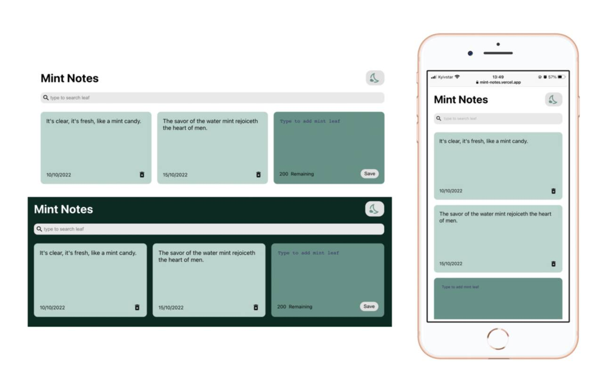

# Mint Notes

## Live version: [Link](https://mint-notes.vercel.app/)

## Description 
A note app made with React  

## Built with
HTML5

CSS

React

## Developer experience 
- learned and practiced some core React concepts, such as re-renders, state management, breaking down your code into components, and pass data between React components;
- learned about unique string ID generator - Nano ID

## Features
- Light and Dark mode;
- Search interface;
- Simple and nice design;
